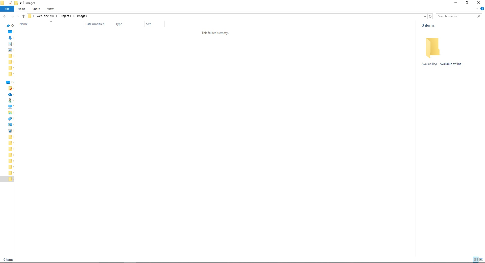

# My First README.md

## Chelsey Hauge

**Hello!**

I'm editing this as I go, mostly because I like the "Here's the progress I've made" sort of feel, and it's fun to look back on that way and see everything that I've learned and how I've managed to correct any mistakes I made! These will be better organized in the future, I promise!

#### **Here's what I've done so far/Update 1:**

- Reviewed Markdown
- Reviewed HTML

As a side note, I've got some experience with both Markdown and HTML, hence the "reviewed" wording. Although I love that there are new things that I'm already experiencing, like using Atom and Github, neither of which I'm familiar with!

#### **Another thing I'm excited about:**

```markdown
Hey, look! A code block. How fancy is that?
These will be super useful in the future.
And I can include things like this:
**I like cats** If this were not in a code block, it would be bold!
```

#### **I also added a screenshot:**

Also, as a side note, I'm wishing PC folders looked as fancy as Mac; I kind of hate the way they look. I've also always thought that being able to apply colors to our folders would be super neat. I know I can't be the only one that loves organizing by colors, right? Just some food for thought.



---
#### **How I've Been Doing So Far:**

To be completely honest, I was totally lost for the first part of the week. Partly because of my own doing, as life kinda got away from me for a bit, but also partly because I'm so used to using [Moodle](http://moodle.umt.edu) for everything, that it felt weird initially to be switching over to Github.

The good news is I think I have a fairly good grasp on it now, and I'm sure I'll be able to better wrap my head around it as I get settled into a routine and get used to being in school again. (Summer breaks are killer for routine.)

#### **Making My Site Live:**

I'm going to be completely honest here, I totally screwed up my projects folders at the beginning. So here's a few things I did wrong and what I did to fix it:

1. I named my original project folder as Project 1, space included.
2. I realized that Project 1 needed to be project-1 instead.
3. Fixed it.
4. I then looked at the Github Desktop App and saw changes needed to be commited, but was confused when I saw copies of Project 1 and now project-1 folders. I briefly thought it had made copies of all my files.
5. I realized that was silly and commited the changes. Everything magically merged together.
6. Finally got everything working so that my html shows up as it should.

#### **Conclusion and Thoughts:**

Despite a slightly rocky start, by no fault other than my own, I'm really enjoying everything so far and I look forward to seeing what my classmates come up with! I love that web design is such an adventure and opens up a world of potential creative opportunities, allows us to customize to our heart's desire, and is really interesting just in general. I'm looking forward to the rest of the semester and am excited to see what everyone's projects look like by the end!
