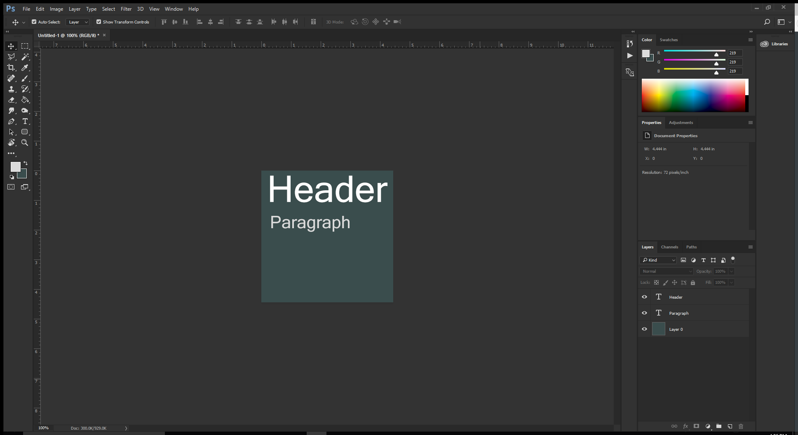
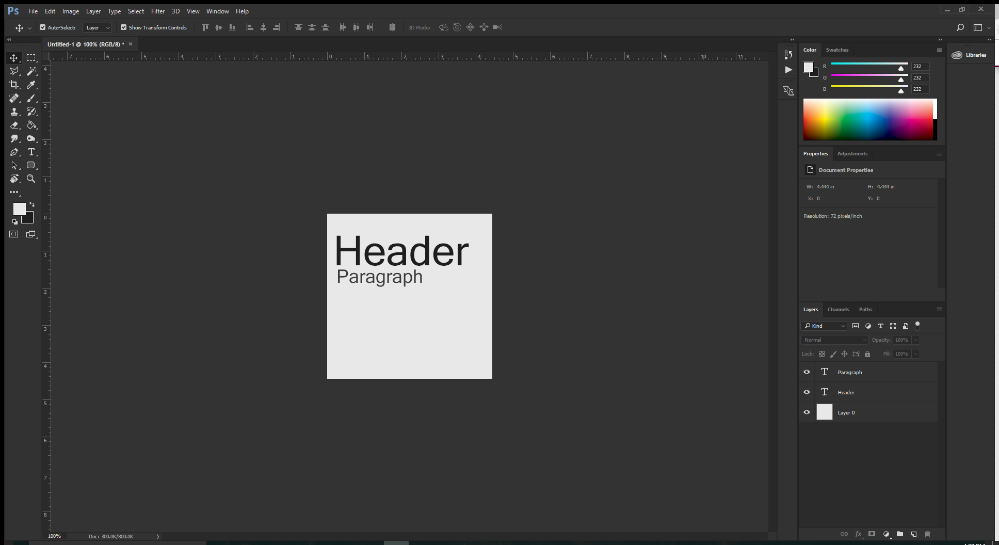

# The Instructable

## Immidiate Problems:

I'm a fan of checking things as I go, so naturally I'm looking at assignment requirements while writing up my Instructable index. The first time I open up the HTML preview, Atom crashes. Which, of course, is not helpful. I've seen a few other people say they've had this same problem. Clearly, there's something wrong with the preview system. I had this same problem last week, but it only crashed upon saving. It seems to be an ongoing issue and doesn't seem to matter if you're previewing markup or html, it crashes either way.

```markdown
Tip: Save before opening your preview window. This might help in the case that Atom decides to crash. You don't want to lose work.
It seems to remember what you were doing before it crashes, but be on the safe side and save anyway. Additionally, toggle preview off before saving.
```
---

## Progress!

Managed to make some headway after eating some food. (It's good to refuel after working for a while, and since I've been sick, I need the extra energy!)

I had to decide on a color palette for my page, so I grabbed my initial background color from [HTML Color Codes](http://htmlcolorcodes.com), which is fantastic if you don't want/can't open Photoshop. I decided, however, to pull it into Photoshop anyway so I could see what my colors would look like. Naturally, I immediately decided I didn't like the color I had chosen and switched to something else.



I sat here and stared at the colors for a bit and again decided I didn't like them. That dark teal-grey is horrible. It really is. So I went with a more minimalist color scheme.



---

## Problems Continued

Well, it seems that Atom continues to crash no matter what I do. This time it crashed while I was typing, and for a moment I thought I'd lost everything. Thank goodness it was still there upon reopening Atom.

---

## Added A Recipe

I've chosen to do an edible cookie dough recipe. I absolutely love cookie dough and it always annoyed me that I couldn't eat it because of the raw eggs, but if you make it without eggs... tadah! Edible!

The following has been done:
- Titled the page
- Included required ```meta``` elements
- Created and included a light ```style```
- Continued to add ```<!--comments-->``` as I went so code would be easy to read
- Added Recipe
- Used ```<cite>``` to indicate where the recipe is from
- Used ```<a href=>``` to link to the recipe
- Included Semantic Markup
- Double checked 6 ```<head>``` elements
- Double checked 4 document structures
- Double checked headings and paragraphs
- Included quote within introductory paragraph
- Included quote at the end of page as well
- Created two nested lists
- Fixed tag errors
- Removed directions from the recipe! (Oops!)

---

## Double Checked *Everything*

Made sure all requirements were covered!

### Project 2 - Part 1 - Complete!
