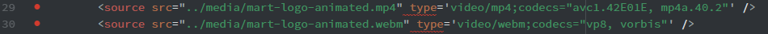

# The Instructable

## Immidiate Problems:

I'm a fan of checking things as I go, so naturally I'm looking at assignment requirements while writing up my Instructable index. The first time I open up the HTML preview, Atom crashes. Which, of course, is not helpful. I've seen a few other people say they've had this same problem. Clearly, there's something wrong with the preview system. I had this same problem last week, but it only crashed upon saving. It seems to be an ongoing issue and doesn't seem to matter if you're previewing markup or html, it crashes either way.

```markdown
Tip: Save before opening your preview window. This might help in the case that Atom decides to crash. You don't want to lose work.
It seems to remember what you were doing before it crashes, but be on the safe side and save anyway. Additionally, toggle preview off before saving.
```
---

## Progress!

Managed to make some headway after eating some food. (It's good to refuel after working for a while, and since I've been sick, I need the extra energy!)

I had to decide on a color palette for my page, so I grabbed my initial background color from [HTML Color Codes](http://htmlcolorcodes.com), which is fantastic if you don't want/can't open Photoshop. I decided, however, to pull it into Photoshop anyway so I could see what my colors would look like. Naturally, I immediately decided I didn't like the color I had chosen and switched to something else.


I sat here and stared at the colors for a bit and again decided I didn't like them. That dark teal-grey is horrible. It really is. So I went with a more minimalist color scheme.


---

## Problems Continued

Well, it seems that Atom continues to crash no matter what I do. This time it crashed while I was typing, and for a moment I thought I'd lost everything. Thank goodness it was still there upon reopening Atom.

---

## Added Recipe Ingredients and Equipment List

I've chosen to do an edible cookie dough recipe. I absolutely love cookie dough and it always annoyed me that I couldn't eat it because of the raw eggs, but if you make it without eggs... tadah! Edible!

The following has been done:
- Titled the page
- Included required ```meta``` elements
- Created and included a light ```style```
- Continued to add ```<!--comments-->``` as I went so code would be easy to read
- Added Recipe
- Used ```<cite>``` to indicate where the recipe is from
- Used ```<a href=>``` to link to the recipe
- Included Semantic Markup
- Double checked 6 ```<head>``` elements
- Double checked 4 document structures
- Double checked headings and paragraphs
- Included quote within introductory paragraph
- Included quote at the end of page as well
- Created two nested lists
- Fixed tag errors
- Removed directions from the recipe! (Oops!)

---

## Double Checked *Everything*

Made sure all requirements were covered!

### Project 2 - Part 1 - Complete!

---

# Project 2 - Part 2

So much reading to do! This is the first thing I do before the start of every project. I read through all the materials and then check for all the project requirements, and then proceed work my way through the project step by step, double checking everything along the way!

## Mistakes were made!

Dang it, I knew I'd do something wrong! There's always something, isn't there? Thank goodness for the issues board and someone having already solved the problem! I had an issue with my images not appear at first. It's that darn second dot. You know, this thing:


## Tables

Tables were admittedly a little confusing, but I am *extremely* grateful for the coding examples on the class website. I'd be way more lost without those! They're super helpful!

## Instructions.html done!

I double checked everything:
- Images are linked properly.
- Pages are linked properly.
- Table elements are all there, with light styling!
- Image attributes are present
- Semantic Markup has been included!

That's quite the checklist! But I'm happy to say I'm pretty sure I've got it all covered!

## On to the Form page!

I thought tabels were confusing, but oh boy was I wrong. Forms are far more confusing! This was a little overwhelming, but I think I got it all figured out!
I double checked everything *again* and I *think* I have everything I needed!

### Project Part 2 Wrap-Up and Conclusions:

Coding is definitely getting more complicated to keep track of with all these new elements to add, but I think I've got the hang of it. (Hopefully?) Like I mentioned before, this part of the project was a bit overwhelming, but I made sure to take plenty of breaks! (Which I highly recommend!) Coding can be a bit of a headache so it's best to take plenty of breaks to give your brain time to rest and not overload yourself with too much at once.

### Project Part 2 complete!

# Project 2 - Part 3

Overwhelming at first, but then... easier! Honestly looking at video and audio instructions freak me out a little. So trying to wrap my head around it was especially hard after a stressful week. That aside, I think I finally figured it out. Though I'll never understand why Atom is trying to tell me there's an error with my type part of my code, but it doesn't seem to be causing any problems and the video is displaying correctly. I know programs like Atom can be finicky at times, so I'm assuming that's what's happening.

Just look at that silly error trying to scare me!

## About Page Complete!

Okay, it was honestly silly to be so overwhelmed by that. It wasn't that bad! Fairly simple, actually. Hopefully I can remember all off the HTML information in the future though! That's a lot to remember.

## To Youtube For More Cookies!

Ah! This one was super easy! I also love that it means sharing the wonderful world of the Tasty! videos with everyone. I love their little recipe videos and they're absolutely *perfect* for a recipe project like this. I don't know why I didn't think of them before! Their little videos really make me want to create my own baking videos. ...Maybe someday! That's a project for the future.

### Project 2 Complete!

### Project Wrap-Up and Final Thoughts:

Although I had some ups and downs with this project, like small victories and a lot of frustration at time (when is coding *not* frustrating?), I really enjoyed this project! I feel like I've learned quite a bit. Now if only I could remember it all... darn my horrible memory. That'll be a challenge in itself, but I always say I like a good challenge! Hopefully future projects will go just as smoothly!
