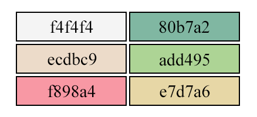
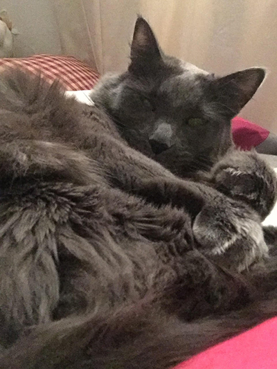

# Project 3 Readme
### Chelsey Hauge

---

#### Project Plans:
1. I think I'm going to do my project in a **blog** style, because I tend to get carried away when writing and I'm awful at coming up with ideas for what sort of book I'd want to do instead. So a blog it is!
2. Since it's a blog post, I'm obviously going to write it myself. Not sure about what yet, but I'm sure it'll come to me. Perhaps a blog about my cat? Perhaps a blog about gaming? We shall see!
3. Age, hobbies, degree I'm working towards are all easy things I could write about myself. Simple and short.
4. Color Palette:

I changed this a few more times than I'd like to admit, actually. But, I found this super cute color palette on Google and thought I'd give it a go! I also may not use all these colors, but I wanted to give myself plenty of options.

---

### Design Plans:

I've decided I'm going to do a blog-style project this time around. It's going to be centered around cats, because that's the one thing I know a lot about. (I'm also your resident crazy cat lady, so just a fair warning that I will probably talk about cats **a lot**.)

Of course my color palette had to be super cute, because cats are cute. I'm channeling my girly side for this, which is weird for me. I could have just as easily chosen motorcycles as my subject too. That might have actually been easier. (I'm also your resident motocycle-loving, video game-playing nerd. (I use 'nerd' in a loving, positive way.)) Next time, maybe?

Ah, but anyway, these colors look really nice together. You can hardly ever go wrong with pastels. I mean, you *can*, but it's hard to mess them up, and there's tons of color palettes online for inspiration!

I know I want to have my nav bar across the top, perhaps this is where I'll have styled buttons that change as you click them.

Above that? A banner. This is gonna take some Photoshop work, but I think I can come up with something cute!

---

### Project Start!

Okay, I'm going to be completely honest, I'm already completely overwhelmed with this. There's so much information to take in and remember. I'll get there eventually, I'm sure, but oof there's a lot.

---

### Frustrations and Successes:

I don't even want to tell you guys how long it took me to get that navigation bar to look the way I wanted it. Tons of research and an unfortunately large amount of time pulling my hair out, I finally got it. It may or may not be 3:30am right now. Okay, it is. It really is, but let's not judge my sleep schedule. It's awful, I know.

**Update:** It's now 5:30am but I really want to get this done. I'm excited to see it all coming together!

I've found that doing my CSS while creating the HTML portion is working really well for me, rather than doing them separately. That way I can section out each bit of my CSS in order of how things appear in my HTML. It also let's me play around with how things are looking bit by bit, instead of worrying about screwing something up at the end!

---

### Progress! - Sample.html done!

*insert happy screaming here*, I finished my sample page! It's so cute! It's kind of simple, but honestly, I think it works! Onwards to other pages!

---

### Index.html Complete!

I realize that seems very backwards to do the index second, but I wasn't sure what I was going to write yet for the sample page, so I did them in reverse.

---

### About.html and Contact.html Complete!

These were actually fairly easy, which I'm thankful for. I'm really happy with how everything's looking though!

---

## Project Wrap-Up Thoughts

That wasn't nearly as bad as I thought it was going to be. It certainly took longer than I expected, but once I really got focused and figured out my plan, it was pretty easy going from there. *And* I'm pretty sure I managed to make sure all requirements were met! That was a big project, but I'm *super* happy with how it turned out!

Cats are fantastic, and mine is adorable and basically my baby, so have another kitty picture just because.
