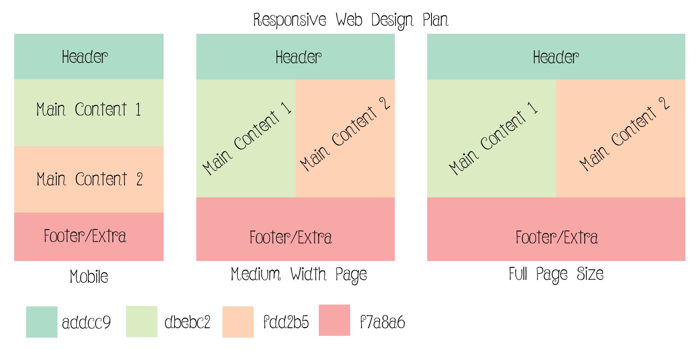

# Project 4 Readme

### Project Plans:

I, thankfully, already knew what I wanted to do for my layout. I also wanted this to be a fairly simple example of responsive web design, so I kept the content kind of light for this one.

Color palette was easy, since I tend to lean towards doing lighter pastel colors.

Look at that! Pretty, right? I always make sure to give myself the hex codes for the colors as well, since it makes it easier to just pull the color palette photo up on my other monitor and quickly type in which color I want!

Also, for anyone who's looking at this and wondering what font that is in the image, it's called Betty. You can find it [here](https://www.dafont.com/betty.font).

### Important Page Parts:

So, the first thing obviously that should catch the eye is the header, although now that I'm looking back on my page I tend to immediately look right at the information pages, which are the main focus. This is probably due to the background color behind each section's text, but they're important as well, so I'm okay with that.

Then, each section explains a little bit about why responsive web design is important. The first section on the left (green box) kind of explains *what* responsive web design is, and the second section (on the right, orange-y color), explains *why* responsive web design is important.

Extra content isn't much, but it's fairly effective, I think. That would be the footer that reinforces the "RWD is **important**!" idea.

### Struggles:

I cannot for the life of me figure out why the box on the right (orange) has a margin to the right of it. There's no margin in my code and I've played with the percentages for size of each box for about 3 hours now. I can't get the margin go away. I don't even know how it got there! To quote Mean Girls, *"She (the margin) doesn't even go here!"*. (Haha?)

So I've decided to let the margin do its thing. You know what, little Margin, have a cookie and grab a seat; welcome to the web page! At this point, if it wants to live there, I'm going to let it live there. It's not hurting anyone and the functionality of the page still works!

This whole problem popped up when I decided I wanted to have spacing around each "box" because everything felt too squished together. But even after removing the changes I'd just made, the margin stayed. SO I guess that's where it lives now. :)

### Fonts!

I decided last minute that I needed to add a little more interest to my page, so I added some fonts!

### Done!

I loved that this was a sort of quicker project and fairly simple, especially with all the tutorial videos. I liked the quiz aspect of them too, it really helped me make sure I was paying attention and understanding things correctly!
